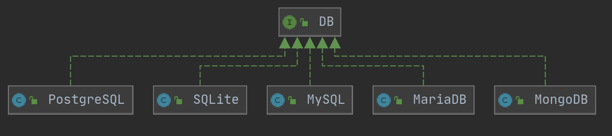
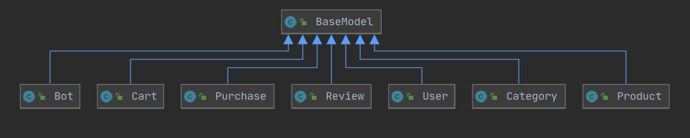

# Alazani


### Table of Contents
* **[Database](#Database)**
   * **[DB Interface](#DB)**
   * **[MySQL Class](#MySQL)**
   * **[Migrations](#Migrations)**
   * **[Seeders](#Seeders)**
   * **[DB-MySQL](#DB-MySQL)**
* **[Models](#Models)**
   * **[BaseModel](#BaseModel)**
   * **[Models-BaseModel](#Models-BaseModel)**
   

<a name="Database"></a>
## Database

<a name="DB"></a>
* **DB** Interface
  ```java
  public interface DB {
      // Queries
      String createTableQuery(String tableName, Map<String, Object> fields);
      String createDatabaseQuery();
      String insertQuery(String tableName, Map<String, Object> fields);
      String updateQuery(String tableName, int id, Map<String, Object> fields);
      String getAllQuery(String tableName);
      String getQuery(String tableName, int id);

      // Execute queries
      void createTable(String tableName, Map<String, Object> fields) throws SQLException;
      void createDatabase() throws SQLException;
      int insert(String tableName, Map<String, Object> fields) throws SQLException;
      void deleteRow(String tableName, int  id) throws SQLException;
      void update(String tableName, int id, Map<String, Object> fields) throws SQLException;
      Map<String, String> get(String tableName, int id) throws SQLException;
      List<Map<String, String>> getAll(String tableName) throws SQLException;
  }
  ```
  
<a name="MySQL"></a>
* **MySQL** Singleton Class (Implements DB Interface)
  ```java
  public class MySQL implements DB {
      private Connection connection;
      private static MySQL mysql_single_instance = null;

      private MySQL() throws SQLException, ClassNotFoundException {
          connectToDatabase();
      }

      // Singleton Class
      public static MySQL getInstance() throws SQLException, ClassNotFoundException {
          if (mysql_single_instance == null)
              mysql_single_instance = new MySQL();
          return mysql_single_instance;
      }
      
      private void connectToDatabase() throws ClassNotFoundException, SQLException {
          Class.forName("com.mysql.jdbc.Driver");
          connection = DriverManager.getConnection(Environment.URL, Environment.USER, Environment.PASSWORD);
          createDatabase();
      }
      
      ...
      /* Overrides of DB Interface */
      ...
  }
  ```
  
<a name="Migrations"></a>
* **Migrations**:

  * Table Creation/Dummy Data Initialization
  ```java
  public class Migration {
      public static void createTables(DB db) throws SQLException {
          db.createTable(User.TABLE_NAME, User.FIELDS);
          db.createTable(Product.TABLE_NAME, Product.FIELDS);
          ...
      }

      public static void createStartingData() {
          UserSeeder.Seed();
          ProductSeeder.Seed();
          ...
      }
  }
  ```
  
  * On Server Start:
  ```java
  @WebListener()
  public class ServerListener implements ServletContextListener,HttpSessionListener, HttpSessionAttributeListener {
      ...
      public void contextInitialized(ServletContextEvent sce) {
          DB db = MySQL.getInstance();
          Migration.createTables(db);
          Migration.createStartingData();
      }
      ...
  }
  ```
  
<a name="Seeders"></a>
* **Seeders**:
  
  Project includes a simple method of seeding your database with test data using seed classes. See example below:
  
  ```java
  public class UserSeeder {
      public static void Seed() {
          new User("Test", "User", BCrypt.hashpw("test", BCrypt.gensalt()), "test", "test@gmail.com").save();
          new User("Admin", "Admin", BCrypt.hashpw("admin451", BCrypt.gensalt()), "GM", "admin@gmail.com").save();
          ...
      }
  }
  ``` 

<a name="DB-MySQL"></a>
* **In the end we have the following hierarchy**


<a name="Models"></a>
* **Models**

  <a name="BaseModel"></a>
  * **BaseModel**
  
  ```java

  public class BaseModel {
      ...
      /* Constructors and util functions*/
      ...
      
      /* CRUD Operations */
      // Create object in Database
      public Object save() {...}

      // Read Object from Database
      public static Map<String, String> getGeneric(String table_name, int id) {...}

      // Update Object in Database
      public boolean update() {...}

      // Delete Object's record from Database
      public void deleteRow() {...}

      // Get all of Objects from Database
      public static List<Map<String, String>> getAllGeneric(String table_name) {...}
  }
  ```


  <a name="Models-BaseModel"></a>
  * **In the end we have the following hierarchy**
  
